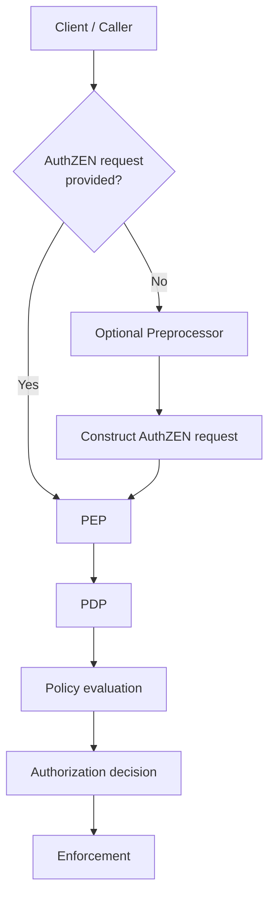

# RFC0052 - Authorization Standardization (Dutch Healthcare Profile)

## Summary

Within the Dutch healthcare domain, authorization is positioned as a *generieke functie* (generic function) as described in national policy frameworks.

As a generieke functie, authorization must:
- operate system-wide across healthcare domains;
- be independent of individual applications and implementations;
- be standardizable and normeerbaar;
- support interoperability between organizations.

This RFC provides a concrete technical interpretation of the generieke functie *Autoriseren* by defining a standardized authorization contract.

The authorization model is based on:
- OpenID AuthZEN Authorization API 1.0  
- the NLGov AuthZEN profile  

Authorization decisions are based on an explicit and standardized authorization request.

Authorization is therefore not derived from the technical structure of API requests, but is expressed through a uniform authorization model.

This enables:
- interoperability across healthcare domains;
- consistent interpretation of authorization attributes;
- reusability of authorization policies;
- clear separation between authorization and implementation;
- alignment with the principles of generieke functies within the Dutch healthcare system.




## Scope

This document defines a standardized authorization contract for data exchange within the Dutch healthcare domain.

The profile is intended for use across healthcare chains, including:
- iWlz  
- Zvw  
- Wmo  
- Jeugdwet  

The model is based on:
- OpenID AuthZEN Authorization API 1.0  
- NLGov AuthZEN profile  


## Core Principle

Authorization within the Dutch healthcare domain is based on an explicit and standardized authorization request.

This request follows the AuthZEN model and forms the sole input for authorization decisions.

Authorization is therefore treated as a separate and independent function, aligned with the principles of generieke functies.

### Key principles

- **Explicit authorization**  
  Authorization decisions are based on a clearly defined authorization request containing `subject`, `action`, `resource`, and `context`.

- **Separation from implementation**  
  Authorization must not depend on the technical structure of API requests (such as GraphQL queries, REST endpoints, or protocol-specific constructs).

- **Technology independence**  
  The authorization model is independent of API technologies and implementation details.

- **Consistency and interoperability**  
  The same authorization request must lead to consistent decisions across different implementations and healthcare domains.

- **Traceability and governance**  
  All attributes used in the authorization request must be traceable to a defined source and governed within the healthcare domain.

### Normative statements

- Authorization decisions are based on an explicit AuthZEN authorization request.
- Authorization must not be derived directly from the technical structure of API requests.
- Implementations should ensure that authorization data is provided in a standardized and interpretable form.

## Preprocessing (Non-normative)

If an incoming request does not contain authorization data in accordance with this specification, an implementation MAY use a pre-processing mechanism (e.g. within a PEP Gateway) to construct such an authorization request.

This is considered a transitional mechanism and is outside the scope of this document.


## Authorization Contract

### Structure

An authorization request consists of:

- subject  
- action  
- resource  
- context  


### Subject

The `subject` describes the actor performing the action within the Dutch healthcare domain.

The structure of the subject follows the AuthZEN model and consists of:

- `type` → the type of actor  
- `id` → the unique identifier of the actor  
- `properties` → additional characteristics relevant for authorization  

| Attribute | Required | Description |
|---|---|---|
| type | Yes | Type of actor (e.g. `organization`, `user`, `system`) |
| id | Yes | Unique identifier of the actor |
| properties | No | Additional domain-specific attributes |


#### Explanation

- The field `type` indicates the nature of the actor performing the request.
- The field `id` uniquely identifies the actor within the context of the system.
- The field `properties` contains additional attributes used in authorization decisions.

Examples of actors in the Dutch healthcare domain include:

- healthcare organizations  
- care providers  
- healthcare payers (e.g. insurers)  
- supervisory authorities  
- systems  
- healthcare professionals  
- citizens (patients or representatives)  


#### Subject Properties

The `properties` object contains domain-specific attributes that may be required for authorization decisions.

Typical attributes include:

- `organization_type` → classification of the organization within the healthcare domain  
- `roles` → roles assigned to the actor (e.g. requester, care provider, administrator)  
- `identifiers` → domain-specific identifiers (e.g. organization identifiers, professional identifiers)  
- `region` → geographical or administrative scope  

Example:

```json
{
  "subject": {
    "type": "organization",
    "id": "org-12345",
    "properties": {
      "organization_type": "ZORGVERZEKERAAR",
      "roles": ["REQUESTER"],
      "identifiers": {
        "organization_id": "12345"
      },
      "region": "NL-MIDDEN"
    }
  }
}
```

### Action

The `action` describes the operation that the subject intends to perform on the resource.

The structure of `action` follows the AuthZEN model and consists of an object with a `name` field.

```json
{
  "action": {
    "name": "read"
  }
}
```

|Attribute| Required | Description|
|---|---|---|
|name|Yes| The operation to be performed on the resource|

Explanation
- The field name represents the intended operation on the resource.
- The value of action.name, in combination with resource and context, determines which authorization rules apply.
- The action is expressed independently of the underlying API technology (e.g. GraphQL, REST, gRPC).

Typical operations in the Dutch healthcare domain include:
- read → retrieving data
- write → creating new data
- update → modifying existing data
- delete → removing data
- notify → sending notifications or signals
- execute → triggering a process or workflow


### Resource

The `resource` describes the object on which the action is performed.

The structure of the resource follows the AuthZEN model and consists of:

- `type` → the type of resource  
- `id` → the unique identifier of the resource  
- `properties` → additional characteristics of the resource  

| Attribute | Required | Description |
|---|---|---|
| type | Yes | Type of the resource (e.g. healthcare data object or service entity) |
| id | Yes | Unique identifier of the resource |
| properties | No | Additional attributes relevant for authorization |


#### Explanation

- The field `type` defines the category of the resource being accessed.
- The field `id` uniquely identifies the specific resource instance.
- The field `properties` contains additional attributes that may influence authorization decisions.

Examples of resources in the Dutch healthcare domain include:

- client or patient records  
- indications or eligibility decisions  
- care assignments or allocations  
- notifications or messages  
- administrative or financial records  


#### Resource Properties

The `properties` object contains domain-specific attributes used in authorization decisions.

Typical attributes include:

- `owner` → the organization responsible for the resource  
- `region` → geographical or administrative scope  
- `sensitivity` → classification level of the data  


### Context

The `context` contains additional information required to evaluate an authorization decision.

The context describes the circumstances under which the action is performed, including the purpose of use, functional context, and the relationship between the involved parties.

| Attribute | Required | Description |
|---|---|---|
| purpose_of_use | Yes | Purpose of the data processing |
| service | Yes | Functional service or domain context |
| operation | Yes | Specific operation within the service |
| relation | Yes | Relationship between subject and resource, based on healthcare, administrative, or legal context |
| contract_active | Yes | Indicates whether a valid relationship exists that justifies access |
| time | Yes | Timestamp of the request (ISO 8601) |


#### Explanation

- `purpose_of_use` defines **why** the data is accessed and must be traceable to a valid legal basis.
- `service` and `operation` together define the **functional context** of the request.
- `relation` describes the **logical or contractual relationship** between the subject and the resource.
- `contract_active` indicates whether access is justified based on an existing relationship.
- `time` records when the request is made and supports time-based authorization.


#### Context Attributes

##### purpose_of_use

The `purpose_of_use` attribute describes the purpose of the data processing.

The specified value must be traceable to a valid legal basis in accordance with GDPR (Article 6 and, where applicable, Article 9).

Typical values within the Dutch healthcare domain include:

- `ZORGUITVOERING` → execution of healthcare tasks  
- `TOEZICHT` → supervisory or regulatory tasks  
- `ONDERZOEK` → research (public task or consent-based)  
- `ADMINISTRATIE` → administrative or legal obligations  

The interpretation of these values must be consistent and governed.


##### service

The `service` attribute identifies the functional domain or service in which the action takes place.

Examples include:

- care allocation services  
- client or patient data services  
- registry services  
- notification services  
- administrative or financial services  

The value of `service` is used to determine which authorization policies apply.


##### operation

The `operation` attribute specifies the functional operation within the service.

This represents a domain-level operation (e.g. "retrieve client", "update allocation") and is distinct from the technical `action`.

- `action` → technical intent (read/write/etc.)  
- `operation` → functional meaning within the domain  

The combination of `service` and `operation` determines the applicable authorization logic.


##### relation

The `relation` attribute describes the relationship between the subject and the resource.

This may represent:

- a treatment relationship  
- an administrative responsibility  
- a supervisory role  
- a contractual or organizational relationship  

Examples include:

- `TREATMENT_RELATION`  
- `CARE_RESPONSIBILITY`  
- `SUPERVISION`  
- `ADMINISTRATIVE_RELATION`  

The meaning of `relation` must be consistent and governed within the healthcare domain.


##### contract_active

The `contract_active` attribute indicates whether a valid relationship exists between the subject and the resource owner.

- `true` → a valid relationship exists  
- `false` → no relationship or unknown  

If the existence of a relationship cannot be determined, it should be treated as `false` (default deny).

The source of this attribute should be a trusted system or registry.


##### time

The `time` attribute represents the timestamp of the request.

- Format: ISO 8601 (e.g. `2026-03-31T10:15:30Z`)
- Used for:
  - time-based authorization  
  - auditing and traceability  


#### Example

```json
{
  "context": {
    "purpose_of_use": "ZORGUITVOERING",
    "service": "CLIENT_SERVICE",
    "operation": "retrieveClient",
    "relation": "TREATMENT_RELATION",
    "contract_active": true,
    "time": "2026-03-31T10:15:30Z"
  }
}
```

## Code Lists

### purpose_of_use

The `purpose_of_use` attribute describes the purpose of the data processing.

The specified value must be traceable to a valid legal basis in accordance with GDPR (Article 6 and, where applicable, Article 9).

The following values are defined for use within the Dutch healthcare domain:

| Value | Typical legal basis | Description |
|---|---|---|
| ZORGUITVOERING | Art. 6(1)(e), Art. 9(2)(h) GDPR | Provision of healthcare and related services |
| ADMINISTRATIE | Art. 6(1)(c), (e) GDPR | Administrative processing and legal obligations |
| DECLARATIE_EN_FINANCIERING | Art. 6(1)(c), (e) GDPR | Financial processing, billing, reimbursement |
| TOEZICHT | Art. 6(1)(e), Art. 9(2)(i) GDPR | Supervision, auditing, and regulatory oversight |
| ONDERZOEK | Art. 6(1)(e), (a), Art. 9(2)(j) GDPR | Scientific or policy research |
| KWALITEITSBEWAKING | Art. 6(1)(e), Art. 9(2)(h) GDPR | Quality monitoring and improvement of care |


#### Explanation

- Each value represents a **functional purpose** within healthcare.
- Each purpose must be justifiable under a **legal basis**.
- The mapping to GDPR articles is indicative and must be validated per use case.


#### Guidelines

- The value of `purpose_of_use` must be explicitly provided in the authorization request.
- The value must be traceable to a legal basis.
- The interpretation of values must be consistent across implementations.
- Domain-specific extensions may be defined, provided they are documented and governed.

### organization_type

The `organization_type` attribute classifies the type of organization or actor within the Dutch healthcare domain.

This attribute is used to support authorization decisions based on the role and responsibility of the subject within the healthcare system.

The values must be traceable to recognized roles within the Dutch healthcare ecosystem and aligned with sector standards (e.g. Nictiz, iStandaarden).

The following values are defined:

| Value | Description |
|---|---|
| ZORGAANBIEDER | Organization providing healthcare services (e.g. hospitals, care institutions, general practitioners) |
| ZORGVERZEKERAAR | Organization responsible for healthcare insurance and reimbursement |
| ZORGKANTOOR | Organization responsible for execution of long-term care (Wlz) |
| OVERHEIDSORGANISATIE | Government body involved in healthcare administration or policy |
| TOEZICHTHOUDER | Supervisory or regulatory authority (e.g. IGJ, NZa) |
| UITVOERINGSORGANISATIE | Organization executing public tasks (e.g. CIZ, CAK) |
| KETENPARTNER | Partner organization within a healthcare chain or collaboration |
| ONDERZOEK_INSTELLING | Organization conducting research in healthcare |
| BURGER | Citizen (patient or representative) |
| SYSTEEM | Non-human actor such as an application or service |


#### Explanation

- The `organization_type` reflects the **role of the actor within the healthcare system**, not its legal form.
- The classification is used to determine applicable authorization rules.
- The values are intended to be **interpretable across healthcare domains** (Zvw, Wlz, Wmo, Jeugdwet).


#### Guidelines

- The value of `organization_type` must be provided as part of `subject.properties`.
- The value must be consistent with recognized roles within the healthcare domain.
- The interpretation of each value must be consistent across implementations.
- Domain-specific refinements may be applied, provided they are documented and governed.


## Governance and Sources

This chapter describes the sources, standards, and governance bodies that underpin the authorization model defined in this document.

The purpose of this chapter is to ensure that all attributes, code lists, and semantics used in the authorization request are traceable to authoritative sources and can be governed consistently across the Dutch healthcare domain.


### Normative Standards

The authorization model defined in this document is based on the following normative standards:

- **OpenID AuthZEN Authorization API 1.0**  
  https://openid.net/specs/authorization-api-1_0.html  

  Defines the structure of the authorization request:
  - subject  
  - action  
  - resource  
  - context  

- **NLGov Profile for OpenID AuthZEN**  
  https://logius-standaarden.github.io/authzen-nlgov/  

  Provides the Dutch government-specific profiling of AuthZEN, including:
  - additional constraints  
  - alignment with national standards  
  - standardized interpretation of attributes  


### Healthcare Domain Sources

The semantics of actors, roles, and relationships within this profile align with established standards in the Dutch healthcare domain:

- **Nictiz – Healthcare Information Standards**  
  https://nictiz.nl/standaarden/  

  Provides national standards for healthcare information exchange, including definitions of actors, roles, and data exchange principles.

- **iStandaarden (iWlz, iWmo, iJw)**  
  https://istandaarden.nl/  

  Defines chain-wide agreements and roles within Dutch healthcare systems.  
  Used as a reference for:
  - actor types  
  - relationships between parties  
  - interoperability across domains  

- **Twiin Trust Framework**  
  https://www.twiin.nl/twiin-vertrouwensmodel  

  Provides a framework for trust, identity, and interaction between healthcare parties.  
  Supports consistent interpretation of:
  - subject identity  
  - relationships (`context.relation`)  
  - authorization context  


### Legal and Regulatory Sources

Authorization decisions must be traceable to a valid legal basis.

The following sources apply:

- **General Data Protection Regulation (GDPR)**  
  https://eur-lex.europa.eu/eli/reg/2016/679/oj  

  In particular:
  - Article 6 → lawful basis for processing  
  - Article 9 → processing of special categories of personal data  

These legal bases are reflected in attributes such as:
- `context.purpose_of_use`


### Code Lists and Attribute Governance

All code lists used in this document must be governed and traceable.

### General principles

- Code lists must be:
  - centrally defined or registered;
  - versioned;
  - traceable to a governance body.

- Domain-specific values (e.g. healthcare roles or services) must:
  - align with existing standards where available;
  - be documented and agreed upon within the relevant governance structure.


#### Examples of governed attributes

| Attribute | Governance source |
|---|---|
| subject.type | AuthZEN specification |
| subject.properties.organization_type | Healthcare domain standards (Nictiz / iStandaarden) |
| context.purpose_of_use | GDPR Article 6 |
| context.service / operation | Domain-specific agreements |


### Responsibility and Governance

The governance of the authorization model is distributed as follows:

- **Structure of the authorization request**  
  Governed by:
  - OpenID Foundation (AuthZEN)
  - Logius (NLGov profile)

- **Healthcare semantics (actors, roles, services)**  
  Governed by:
  - Nictiz  
  - iStandaarden  
  - sector-specific agreements  

- **Legal basis and compliance**  
  Governed by:
  - European Union (GDPR)
  - National legislation and supervisory authorities  

### Extensibility and Domain Profiles

This document defines a base profile for the Dutch healthcare domain.

Domain-specific profiles (e.g. iWlz, Zvw, Wmo) may extend this model by:

- defining additional code lists;
- constraining attribute values;
- specifying domain-specific semantics.

Such extensions must:

- remain compatible with the base AuthZEN structure;
- be formally documented;
- reference their governance source.


